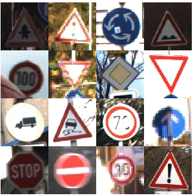

**Created on 2017.07.10**
# Caffe Frame work tutorial with traffic sign recognition

### System Installation
 * Requirement
   * OS : Ubuntu
   * Dependency
     * python2.7++
     * openCV 2.4.8++
     * CUDA 7.5++
     * cudnn4++
   * Dataset
     * [GTSRB Homepage](http://benchmark.ini.rub.de/?section=gtsrb&subsection=news)
     * Dataset Download
       * [train dataset](http://benchmark.ini.rub.de/Dataset/GTSRB_Final_Training_Images.zip)
       * [test dataset](http://benchmark.ini.rub.de/Dataset/GTSRB_Final_Test_Images.zip)
       * [test gt dataset](http://benchmark.ini.rub.de/Dataset/GTSRB_Final_Test_GT.zip)
</br>
  
---------------------------------------
### Tutorial Structure
* Directory
   * images
     * README.md에 삽입되는 image 및 기타 image저장
   * label
     * GTSRB dataset(test/training)에 대한 label 파일 저장
   * lenet
     * leNet network prototxt 저장
   * resNet
     * resNet(20/32) network prototxt 저장
   * old_script
     * previous lmdb creating script

* Script file
   * build.sh
     * caffe build script
   * create_data_list.py
     * creating dataset(GTSRB) label script
   * get_data.py
     * download dataset(GTSRB) script
   * create_lmdb.py
     * create dataset(GTSRB) lmdb & mean_binaryfile script
   * test_lenet.sh
   * test_resnet_20.sh
   * test_resnet_32.sh
   * train_lenet.sh
   * train_resnet_20.sh
   * train_resnet_32.sh
   
---------------------------------------
### How to Use
1. Caffe build
```shell
* Using Script
  ./build.sh [CAFFE_HOME_PATH]

* Using Bash shell
 cd $CAFFE_HOME
 make -j[cpu core] --> make -j8
```

2. Download GTSRB dataset
 * Default dataset store : $HOME/data/GTSRB
   * Training data : $HOME/data/GTSRB/Final_Training/Images
   * Test data : $HOME/data/GTSRB/Final_Test/Images
   * Test_gt_csv file : $HOME/data/GTSRB/GT-final_test.csv 
```shell
* Using Script
 cd $CAFFE_HOME/examples/traffic_sign_recognition
 python get_data.py
```

3. Create data label
 * Label Format
   * Training
   ```md
   [class folder name]/[image filename] [class id]
   ```
   * Test
   ```md
   [image filename] [class id]
   ```
 * Label file store
   * Training
     * $HOME/data/GTSRB/Final_Training/Images/train_label.txt
     * $CAFFE_HOME/examples/traffic_sign_recognition/label/train_label.txt
   * Test
     * $HOME/data/GTSRB/Final_Test/Images/test_label/txt
     * $CAFFE_HOME/examples/traffic_sign_recognition/label/test_label.txt
```shell
* Using Script
 cd $CAFFE_HOME/examples/traffic_sign_recognition
 python create_data_list.py
```

4. Create LMDB
 * LMDB store path
 ```md
 - default path : $HOME/data/GTSRB/lmdb/[train_lmdb/test_lmdb]
 - link : $CAFFE_HOME/exmaples/traffic_recognition/lmdb/[train_lmdb/test_lmdb]
 ```
 * LMDB store path
  ```md
 - default path : $HOME/data/GTSRB/lmdb/[train_mean.binaryproto]
 - link : $CAFFE_HOME/exmaples/traffic_recognition/lmdb/[train_mean.binaryproto]
 ```
 ```shell
 * Using Script
 python create_lmdb.py
 
 usage: create_lmdb.py [-h] caffe_root

 positional arguments:
  caffe_root  Please Input CAFFE HOME PATH(eg. /home/user/caffe) 
 ```

5. Training
 * example network model
   * lenet : /models/lenet
   * resnet : /models/resnet20 && /models/resnet32
 * default lmdb path
   * train : /lmdb/train_lmdb
   * test : /lmdb/test_lmdb
   * mean_binary : /lmdb/train_mean/binaryproto
  ```shell
 * Using Script
 cd $CAFFE_HOME/examples/traffic_sign_recognition
 python train.py
 
usage: train.py [-h] [--gpus GPUS] [--run-soon]
                [--network-model-name NETWORK_MODEL_NAME]
                caffe_root

positional arguments:
  caffe_root            Please Input CAFFE HOME PATH(eg. /home/user/caffe)

optional arguments:
  -h, --help            show this help message and exit
  --gpus GPUS           Define GPU device ID
  --run-soon            Directly Train Script Excuting
  --network-model-name NETWORK_MODEL_NAME
                        Choose Applying Network Type(ex, lenet, resnet20,
                        resnet32 etc)

 ```
6. Test
  ```shell
 * Using Script
 cd $CAFFE_HOME/examples/traffic_sign_recognition
 python test.py
 
usage: test.py [-h] [--gpus GPUS] [--run-soon]
               [--network-model-name NETWORK_MODEL_NAME]
               caffe_root

positional arguments:
  caffe_root            Please Input CAFFE HOME PATH(eg. /home/user/caffe)

optional arguments:
  -h, --help            show this help message and exit
  --gpus GPUS           Define GPU device ID
  --run-soon            Directly Train Script Excuting
  --network-model-name NETWORK_MODEL_NAME
                        Choose Applying Network Type(ex, lenet, resnet20,
                        resnet32 etc)

 ```
 
